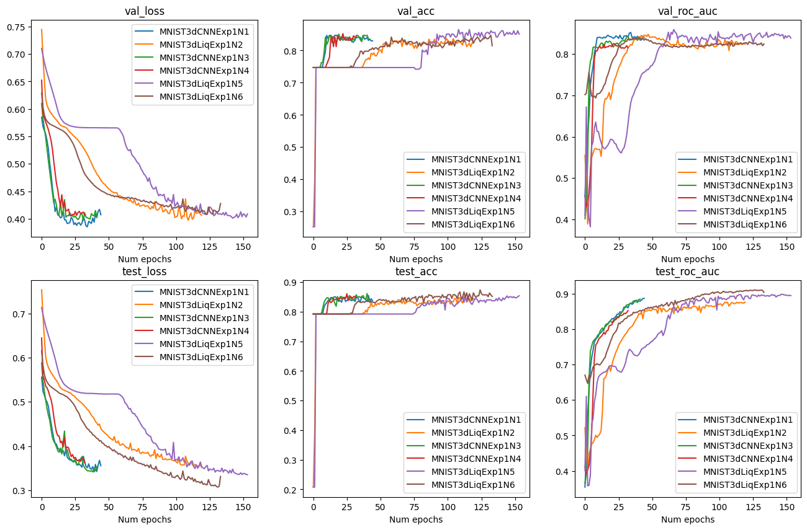

# Lung Tissues Classification

## Introduction

The modern healthcare sector utilizes various technologies to improve patient outcomes and accelerate the recovery process. A key element of medical interventions involves the use of biomedical images, which play a crucial role in enabling more precise diagnoses and developing effective treatment strategies. However, the interpretation of such images is susceptible to human error, which can result in negative outcomes such as incorrect treatment selection and delayed disease detection. The integration of deep learning techniques has significantly enhanced the accuracy of image analysis by identifying potentially problematic cases for further review by healthcare professionals. These advanced methods have changed the approach towards analyzing and interpreting biomedical data and they provide with automated frameworks that help in the identification of diseases.

In recent years, the field has experienced rapid advancements in deep learning technologies. Besides other popular approaches that have emerged, the application of Liquid Neural Networks stands out as a promising possibility to enhance the accuracy and efficiency of medical image analysis. Inspired by the dynamic behavior of liquid systems, LNNs are offering a unique framework that utilizes adaptive and self-organizing neural layers to make predictions. This course work shows the potential of Liquid Neural Networks as a new deep learning technique, with a specific focus on their application to the analysis of diverse medical data.

For the analysis I used standartized MedMNIST datasets to conduct the experiments. The utilization of the MedMNIST datasets serves as a initial step, providing with a great source of medical image data for training and validating neural network models. MedMNIST collection of images contain 6 different 3D image sets to train a model on, such as AdrenalMNIST3D and VesselMNIST3D and etc. The images are already preprocessed and ready to be used, and the sizes of the datasets are relatively small and it is possible to perform the analysis without the need for significant computational resources. Another advantage of the datasets is that they are widely used, and there are some solid benchmarks to compare the results with. Overall, the datasets allow to conduct fast experiments on the data to compare the quality of different architectures. 

The research question of this paper is to find which configurations of Liquid Neural Network architectures provide with the best results on the data. It will be compared to the current popular approaches, which are mostly convolutional neural networks. In comparison to them, the model is not only capturing the current snapshot of the data and averages the result, but includes the dynamics of the images for predictions.

## Datasets

The datasets come from the public MedMnist library. It contains a broad 2D and 3D images collection for a classification problem. For the experiments a choose three different datasets for binary classification. Each of them have thousands of images of a similar scale.

**AdrenalMNIST3D.** This dataset is obtained from Zhongshan Hospital data and contains shape masks of 1584 adrenal glands. They are split into 1188 samples for training, 98 for validation and 298 for testing. The shapes are 3D (28x28x28) and used for binary classification.

**NoduleMNIST3D.** This dataset contains thoracic CT scans. They are split into 1158 samples for training, 165 for validation and 310 for testing. The images are 3D (28x28x28) and used for binary classification.

**VesselMNIST3D.** This is a 3D intracranial aneurysm dataset, which contains 103 3D models of entire brain vessels collected by reconstructing MRA images. The total number of 1,694 healthy vessel segments and 215 aneurysm segments are created automatically by the complete models. The images are 3D (28x28x28) and used for binary classification. They are split into 1335 samples for training, 191 for validation and 382 for testing.

## Implementation

### Training setup

For the training I used two different templates for convolutional models. The first template used only linear and convolutional layers in their architecture and later the models are called "convolutional". In the second template I also used liquid layers in the models with different kinds of wirings, the number of neurons, the number of layers.

I train each model with batch size of 64 images using torch.optim.Adam for 500 epochs. The learning rate is set to 0.0005 for NoduleMNIST3D and VesselMNIST3D datasets, and it is set to 0.001 for AdrenalMNIST3D dataset. To avoid overfitting there is an early stopping of the training process - if the validation loss was larger by 0.001 for 10 epochs than the best validation loss. For the loss function I used binary cross entropy, while also reporting accuracy and ROC AUC metric.

### Results

The first experiment tested the models with a basic CNN architecture and Liquid neural networks with AutoNCP wirings. The first layers of each model were two Convolutional layers with 6, 16 channels output and (5, 5), (3, 3) kernel sizes respectively. After each of them I applied RELU activation function and maximum-2D pooling of size (2, 2). The most promising models for NoduleMNIST3D dataset were:

**MNIST3dCNNExp1N1** - the convolutional layers are followed by three linear layers with RELU activation function of outputs (120, 84, 1). ACC: 0.838; ROC AUC: 0.887; Num parameters: 59405.

**MNIST3dLiqExp1N5** - the convolutional layers are followed by two liquid layers with 21 and 7 neurons respectively, and RELU activation between them. ACC: 0.854; ROC AUC: 0.895; Num parameters: 37930.

**MNIST3dLiqExp1N6** - the convolutional layers are followed by one liquid layer with 30 neurons. ACC: 0.852; ROC AUC: 0.904; Num parameters: 53528.

## Conclusion

TODO
