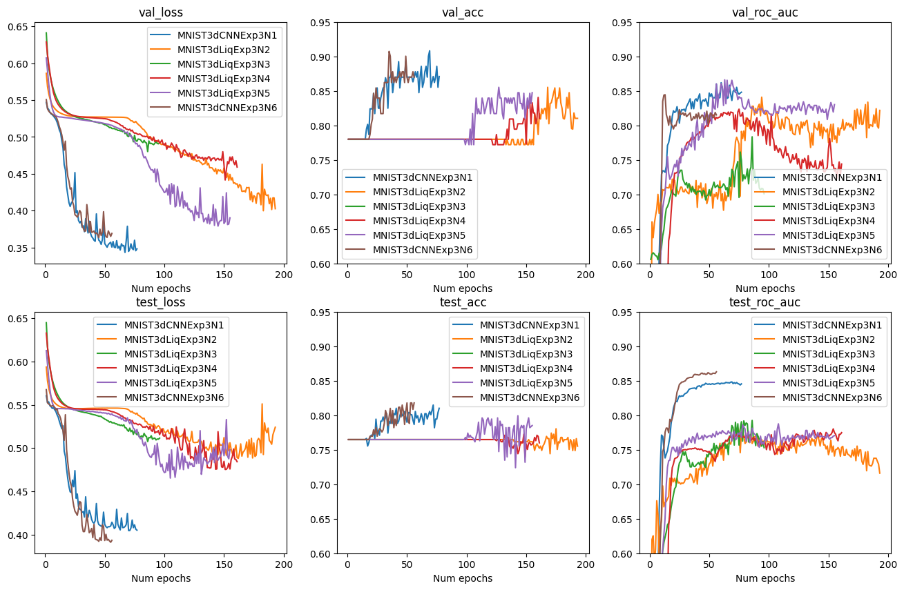
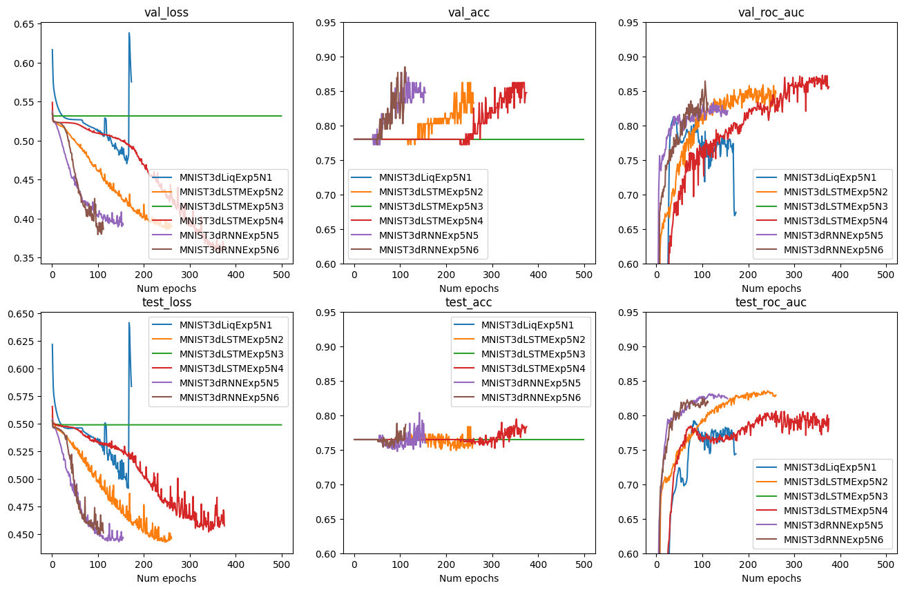
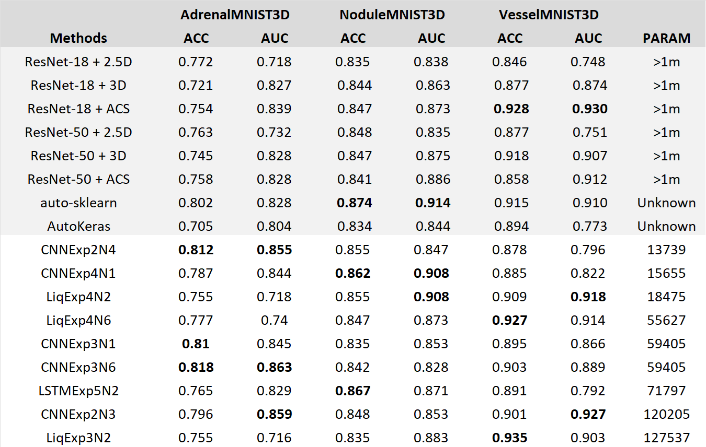

# Application of Liquid Neural Networks to 3D images classification on the example of MedMNIST datasets 

## Introduction

The modern healthcare sector utilizes various technologies to improve patient outcomes and accelerate the recovery process. A key element of medical interventions involves the use of biomedical images, which play a crucial role in enabling more precise diagnoses and developing effective treatment strategies. However, the interpretation of such images is susceptible to human error, which can result in negative outcomes such as incorrect treatment selection and delayed disease detection. The integration of deep learning techniques has significantly enhanced the accuracy of image analysis by identifying potentially problematic cases for further review by healthcare professionals. These advanced methods have changed the approach towards analyzing and interpreting biomedical data and they provide with automated frameworks that help in the identification of diseases.

In recent years, the field has experienced rapid advancements in deep learning technologies. Besides other popular approaches that have emerged, the application of Liquid Time-Constant Neural Networks stands out as a promising possibility to enhance the accuracy and efficiency of medical image analysis. First they were introduced by (Hasani and etc, 2021) and now they could serve as a replacement to traditional linear layers when analizing sequential data, and an alternative to other recurrent neural networks. Inspired by the dynamic behavior of liquid systems, LNNs are offering a unique framework that utilizes adaptive and self-organizing neural layers to make predictions. This course work shows the potential of Liquid Neural Networks as a new deep learning technique, with a specific focus on their application to the analysis of diverse medical data.

For the analysis I used standartized MedMNIST datasets to conduct the experiments. The utilization of the MedMNIST datasets serves as a initial step, providing with a great source of medical image data for training and validating neural network models. MedMNIST collection of images contain 6 different 3D image sets to train a model on, such as AdrenalMNIST3D and VesselMNIST3D and etc. The images already have been preprocessed, and they are ready to be used.  The sizes of the datasets are relatively small and it is possible to perform the analysis without the need for significant computational resources. Another advantage of the datasets is that they are widely used, and there are some solid benchmarks to compare the results with. Overall, the datasets allow to conduct fast experiments on the data to compare the quality of different architectures.

The research question of this paper is to find which configurations of Liquid Neural Network architectures provide with the best results on the data, and compare them to the other methods and configurations. Then it will be compared to the current popular approaches, which are mostly convolutional neural networks. This study contributes to the current literature about Liquid Time-constant networks, classification of medical images and processing time-series data. 

## Datasets

The datasets come from the public MedMnist library. It contains a broad 2D and 3D images collection for a classification problem. For the experiments a choose three different datasets for binary classification. Each of them have thousands of images of a similar scale (28x28x28).

**AdrenalMNIST3D.** This dataset is obtained from Zhongshan Hospital data and contains shape masks of 1584 adrenal glands. They are split into 1188 samples for training, 98 for validation and 298 for testing.

**NoduleMNIST3D.** This dataset contains thoracic CT scans. They are split into 1158 samples for training, 165 for validation and 310 for testing.

**VesselMNIST3D.** This is a 3D intracranial aneurysm dataset, which contains 103 3D models of entire brain vessels collected by reconstructing MRA images. The total number of 1,694 healthy vessel segments and 215 aneurysm segments are created automatically by the complete models. They are split into 1335 samples for training, 191 for validation and 382 for testing.

## Implementation

### Training setup

In this study, each model was trained using a batch size of 64 images. The training process was carried out using the Adam optimization algorithm. This process was repeated for 500 epochs. The learning rate was set at a constant 0.0005 across all datasets. To prevent overfitting and decrease the total learning time, an early stopping mechanism was implemented. If the validation loss has increased by more than 0.001 over the best previously recorded validation loss for 10 epochs, the training process was stopped. The model's performance was evaluated using the binary cross-entropy loss function, which is a popular method for binary classification problems. In addition, the accuracy of the model and ROC AUC were also reported.

### Results

I conducted five experiments. Each experiment used six different models for each dataset. This means that a total of 90 models were trained. Most of these models had a similar structure for their initial two convolutional layers. The first layer had an output of 6 channels, and the second layer had an output of 16 channels. The kernel sizes used for these layers were (5, 5) and (3, 3) respectively. Following each of these layers, a maximum 2D-pooling operation was performed to reduce the size of the output and control overfitting. After the pooling operation, a RELU activation function was applied. This function helps to introduce non-linearity into the model and improves the learning process. For the fourth experiment, the layers were slightly altered. Two additional convolutional layers were included, each with the same number of channels as the initial layers.

Firstly, the study made use of traditional Convolutional Neural Networks. These models predicted targets individually for each timestamp. This means that they make predictions based on the data available at a specific point in time, without considering the sequence of data. After making individual predictions for each timestamp, the results are then averaged to provide a single output. Afterwards, the study also included models that utilized Liquid Time-constant layers. In contrast to the CNNs, these models are designed to predict on sequential data. They take into account the order of data points and make predictions based on the entire sequence of data rather than individual timestamps. Finally, the study involved training a few Long Short-Term Memory and Recurrent Neural Network models. These models were trained and their results compared with the CNN and LTC models to identify the most effective approach.

These experiments first are be described individually, then I choose the best out of them, join and compare to the benchmarks provided to these datasets.

### Experiment 1.

The first experiment tested the models with a basic CNN architecture and Liquid neural networks with AutoNCP wirings. The convolutional layers are followed by:

**MNIST3dCNNExp1N1** - three linear layers with RELU activation function of outputs (120, 84, 1).

**MNIST3dLiqExp1N2** - one LTC layer with 21 neurons.

**MNIST3dCNNExp1N3** - the architecture coincides with MNIST3dCNNExp1N1 but with the different random state.

**MNIST3dCNNExp1N4** - three linear layers with RELU activation function of outputs (60, 42, 1).

**MNIST3dLiqExp1N5** - two liquid layers with 21 and 7 neurons respectively, and RELU activation between them.

**MNIST3dLiqExp1N6** - one liquid layer with 30 neurons.

#### Experiment 1. NoduleMNIST3D

#### Experiment 1. AdrenalMNIST3D

#### Experiment 1. VesselMNIST3D

The performance of Liquid Neural Networks varied across the three datasets. For the AdrenalMNIST3D dataset, the LTC models didn't perform well. The traditional CNNs were much better in terms of results, and they also required less time to train.  However, the LTC performed better with the other two datasets. For the NoduleMNIST3D dataset, a Liquid Neural Network with a single Liquid layer of 30 neurons showed slightly improved results compared to its CNN counterparts. The rest of the models, however, performed similarly to the CNNs. The most significant improvement was seen with the VesselMNIST3D dataset. Here, the some Liquid Neural Networks greatly outperformed the traditional CNN models. In summary, for experiment 1 while the Liquid Neural Networks struggled with the AdrenalMNIST3D dataset, they showed comparable or even superior performance with the NoduleMNIST3D and VesselMNIST3D datasets.

### Experiment 2.

The second experiment tested other configurations of CNN architecture and Liquid neural networks with Fully Connected wirings (only in this experiment). The convolutional layers are followed by:

**MNIST3dCNNExp2N1** - five linear layers with RELU activation function of outputs (128, 128, 64, 32, 1).

**MNIST3dLiqExp2N2** - one LTC layer with 21 neurons and Fully Connected wiring.

**MNIST3dCNNExp2N3** - three linear layers with RELU activation function of outputs (256, 64, 1).

**MNIST3dCNNExp2N4** - three linear layers with RELU activation function of outputs (30, 21, 1).

**MNIST3dLiqExp2N5** - two liquid layers with 21 and 7 neurons respectively, and RELU activation between them, and Fully Connected wirings.

**MNIST3dLiqExp2N6** - one liquid layer with 30 neurons and Fully Connected wiring.

#### Experiment 2. NoduleMNIST3D

#### Experiment 2. AdrenalMNIST3D

#### Experiment 2. VesselMNIST3D

The performance of LTC remained the same on Adrenal and Nodule datasets, however with Fully Connected they produced significantly worse results on a Vessel dataset.

### Experiment 3.

The third experiment tested combinations of liquid and linear layers, and adding dropout. For all LTC AutoNCP wiring was used. The convolutional layers are followed by:

**MNIST3dCNNExp3N1** - three linear layers with RELU activation function of outputs (120, 84, 1) and dropout 0.2 after each layer.

**MNIST3dLiqExp3N2** - one linear layer with RELU activation function and dropout of 0.2 of output (256), and LTC layer with 21 neurons.

**MNIST3dLiqExp3N3** - batch normalization, dropout of 0.2 and single LTC layer with 21 neurons.

**MNIST3dLiqExp3N4** - dropout of 0.2 and single LTC layer with 21 neurons.

**MNIST3dLiqExp3N5** - one LTC layer with 21 neurons and output of 14, followed by linear layer with output of 1.

**MNIST3dCNNExp3N6** - three linear layers with RELU activation function of outputs (120, 84, 1) and dropout 0.2 after each layer. In comparison to MNIST3dCNNExp3N1, the final layer was applied after averaging the results for each timestamp.

#### Experiment 3. NoduleMNIST3D

#### Experiment 3. AdrenalMNIST3D

#### Experiment 3. VesselMNIST3D

The results are similar to Experiment 1.

### Experiment 4.

For this experiment I added two additional convolutional layers before the application of the algorithms. For all LTC AutoNCP wiring was used. The convolutional layers are followed by:

**MNIST3dCNNExp4N1** - three linear layers with RELU activation function of outputs (64, 32, 1).

**MNIST3dLiqExp4N2** - one LTC layer with 21 neurons.

**MNIST3dCNNExp4N3** - three linear layers with RELU activation function of outputs (120, 84, 1). Also I removed pooling from the last convolutional layer.

**MNIST3dCNNExp4N4** - three linear layers with RELU activation function of outputs (60, 42, 1). Also I removed pooling from the last convolutional layer.

**MNIST3dLiqExp4N5** - two liquid layers with 21 and 7 neurons respectively, and RELU activation between them.

**MNIST3dLiqExp4N6** - one LTC layer with 21 neurons. Also I removed pooling from the last convolutional layer.

#### Experiment 4. NoduleMNIST3D

#### Experiment 4. AdrenalMNIST3D

#### Experiment 4. VesselMNIST3D

The results are similar to Experiment 1.

### Experiment 5.

This experiment included recurrent neural networks and LSTM in comparison to a small liquid neural network. 

**MNIST3dLiqExp5N1** - one LTC layer with 5 neurons

**MNIST3dLSTMExp5N2** - one LSTM layer with 40 hidden state features followed by one linear layer with output of 1.

**MNIST3dLSTMExp5N3** - two LSTM layers of 40 and 1 hidden state features respectively.

**MNIST3dLSTMExp5N4** - two LSTM layers with 40 hidden state features followed by one linear layer with output of 1.

**MNIST3dRNNExp5N5** - one RNN layer with 40 hidden state features followed by one linear layer with output of 1.

**MNIST3dRNNExp5N6** - two RNN layers with 40 hidden state features followed by one linear layer with output of 1.

#### Experiment 5. NoduleMNIST3D

#### Experiment 5. AdrenalMNIST3D

#### Experiment 5. VesselMNIST3D

In this experiment the Liquid Time-Constant network shows worse results than other recurrent neural networks, however LTC netoworks from the other experiments outperform RNN and LSTM networks, having significantly less parameters.

### Metrics comparison

The table below compares the metrics of the top methods against public benchmarks and among various experiments. The results reveal big differences across the datasets. Liquid Time-Constant models did not do well with the AdrenalMNIST3D dataset. However, they produced similar or slightly superior results on the other two datasets. Interestingly, the advantage of having fewer parameters in the LTC models doesn't seem to offer significant benefits when compared to small convolutional networks. It's also important to note that Liquid Neural Networks take substantially longer to train than their CNN counterparts. Comparing to the recurrent neural networks, the advantages of LTC networks are more noticable - in most configurations they outperform their RNN and LSTM counterparts and they are much smaller. All the proposed models show better results than the public benchmarks.

## Conclusion

TODO

## References

1. **Hasani, R., Lechner, M., Amini, A., Rus, D., & Grosu, R.** (2021). Liquid Time-constant Networks. Proceedings of the AAAI Conference on Artificial Intelligence, 35(9), 7657-7666. https://doi.org/10.1609/aaai.v35i9.16936

2. **Lai, Z., Wu, J., Chen, S., Zhou, Y., & Hovakimyan, N.** (2024). Language Models are Free Boosters for Biomedical Imaging Tasks. arXiv (Cornell University). https://doi.org/10.48550/arxiv.2403.17343

3. **Yang, J., Shi, R., & Ni, B.** (2021). MedMNIST Classification Decathlon: A Lightweight AutoML Benchmark for Medical Image Analysis. In 2021 IEEE 18th International Symposium on Biomedical Imaging (ISBI) (pp. 191-195). Nice, France. doi: https://doi.org/10.1109/ISBI48211.2021.9434062
