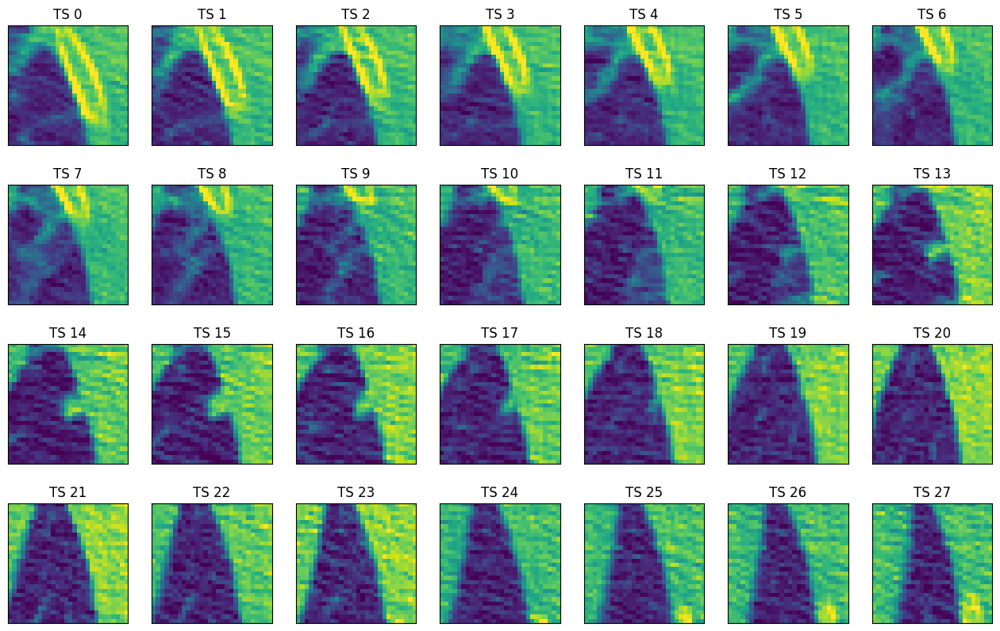
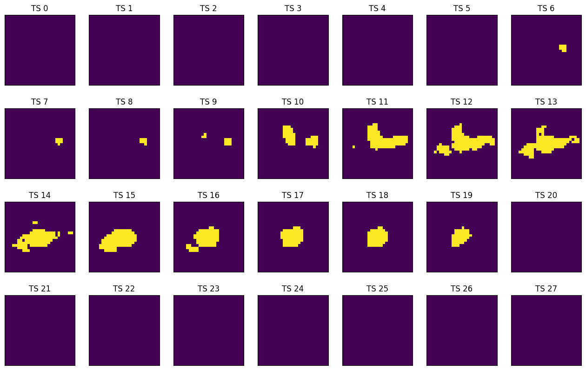
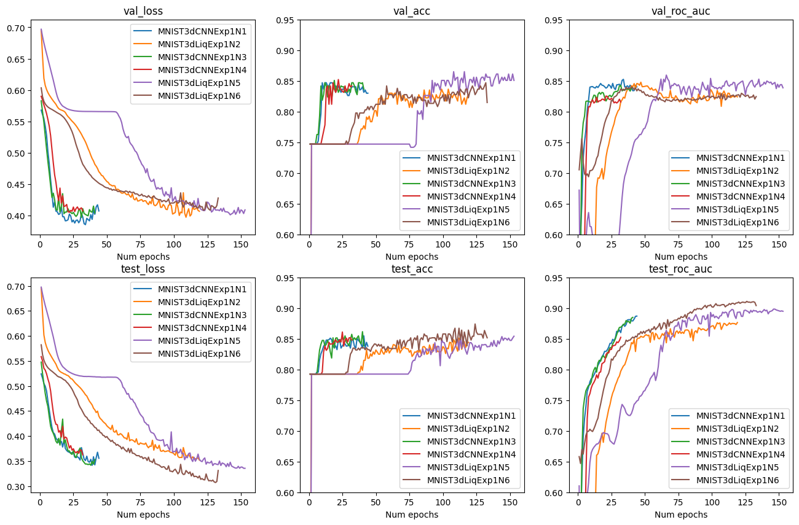
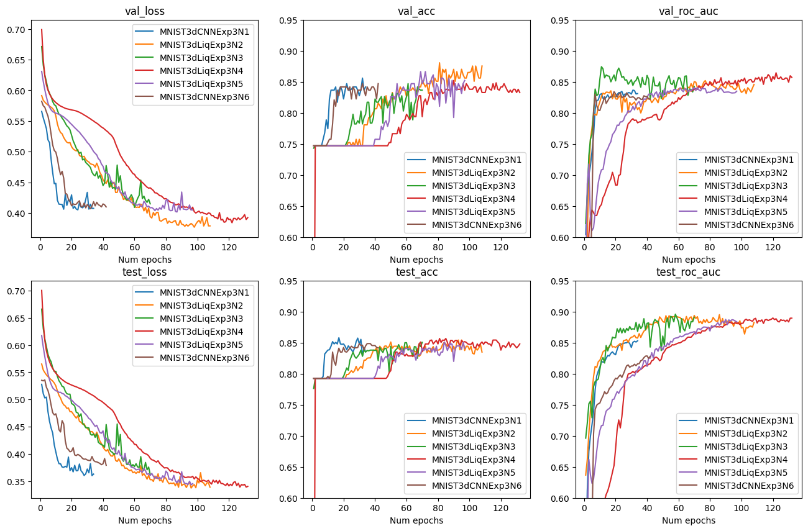
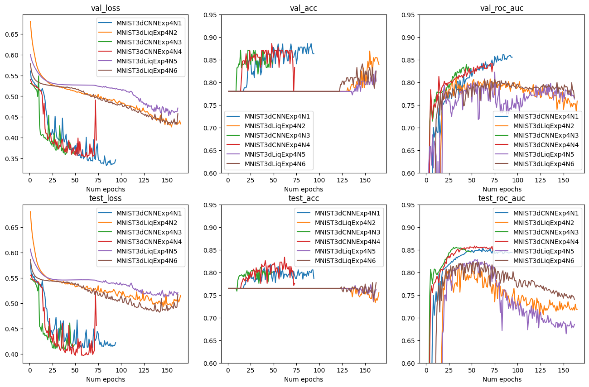
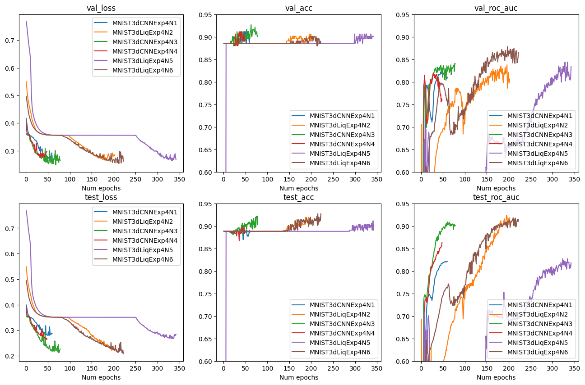

# Application of Liquid Neural Networks to 3D images classification on the example of MedMNIST datasets 

## Introduction

&nbsp;&nbsp;&nbsp;&nbsp; The modern healthcare sector utilizes various technologies to improve patient outcomes and accelerate the recovery process. A key element of medical interventions involves the use of biomedical images, which play a crucial role in enabling more precise diagnoses and developing effective treatment strategies. However, the interpretation of such images is susceptible to human error, which can result in negative outcomes such as incorrect treatment selection and delayed disease detection. The integration of deep learning techniques has significantly enhanced the accuracy of image analysis by identifying potentially problematic cases for further review by healthcare professionals. These advanced methods have changed the approach towards analyzing and interpreting biomedical data and they provide with automated frameworks that help in the identification of diseases.

&nbsp;&nbsp;&nbsp;&nbsp; In recent years, the field has experienced rapid advancements in deep learning technologies. Besides other popular approaches that have emerged, the application of Liquid Time-Constant Neural Networks stands out as a promising possibility to enhance the accuracy and efficiency of medical image analysis. First they were introduced by (Hasani and etc, 2021) and now they could serve as a replacement to traditional recurrent neural networks or aggregated output of linear layers when analizing sequential data. Inspired by the dynamic behavior of liquid systems, LNNs are offering a unique framework that utilizes adaptive and self-organizing neural layers to make predictions. This term work shows the potential of Liquid Neural Networks as a new deep learning technique, with a specific focus on their application to the analysis of diverse medical data. The main advantage of LTC is that they have significantly less parameters than other RNNs. The main focus of the term paper is to train relatively compact networks, and assess how LTC works in comparison to the other methods. Then they will be compared to the benchmarks models, which have significantly more parameters. This study contributes to the current literature about Liquid Time-constant networks, classification of medical images and processing sequential data.

&nbsp;&nbsp;&nbsp;&nbsp; For the analysis I used standartized MedMNIST datasets to conduct the experiments. The utilization of the MedMNIST datasets serves as a initial step, providing with a great source of medical image data for training and validating neural network models. MedMNIST collection of images contain 6 different 3D image sets to train a model on, such as AdrenalMNIST3D and VesselMNIST3D and etc. The images already have been preprocessed, and they are ready to be used.  The sizes of the datasets are relatively small and it is possible to perform the analysis without the need for significant computational resources. Another advantage of the datasets is that they are widely used, and there are some solid benchmarks to compare the results with. Overall, the datasets allow to conduct fast experiments on the data to compare the quality of different architectures.

## Datasets

&nbsp;&nbsp;&nbsp;&nbsp; The datasets come from the public MedMnist library. It contains a broad 2D and 3D images collection for a classification problem. For the experiments a choose three different datasets for binary classification. Each of them have thousands of images of a similar scale (28x28x28).

**NoduleMNIST3D.** This dataset contains thoracic CT scans. They are split into 1158 samples for training, 165 for validation and 310 for testing.

#### Figure 1. Nodule Dataset Sample

**AdrenalMNIST3D.** This dataset is obtained from Zhongshan Hospital data and contains shape masks of 1584 adrenal glands. They are split into 1188 samples for training, 98 for validation and 298 for testing.

#### Figure 2. Adrenal Dataset Sample

**VesselMNIST3D.** This is a 3D intracranial aneurysm dataset, which contains 103 3D models of entire brain vessels collected by reconstructing MRA images. The total number of 1,694 healthy vessel segments and 215 aneurysm segments are created automatically by the complete models. They are split into 1335 samples for training, 191 for validation and 382 for testing.

#### Figure 3. Vessel Dataset Sample

## Implementation

### Training setup

&nbsp;&nbsp;&nbsp;&nbsp; In this study, each model was trained using a batch size of 64 images. The training process was carried out using the Adam optimization algorithm. This process was repeated for 500 epochs. The learning rate was set at a constant 0.0005 across all datasets. To prevent overfitting and decrease the total learning time, an early stopping mechanism was implemented. If the validation loss has increased by more than 0.001 over the best previously recorded validation loss for 10 epochs, the training process was stopped. The model's performance was evaluated using the binary cross-entropy loss function, which is a popular method for binary classification problems. In addition, the accuracy of the model and ROC AUC were also reported.

### Methodology

&nbsp;&nbsp;&nbsp;&nbsp; I conducted five experiments. Each experiment used six different models for each dataset. This means that a total of 90 models were trained. Most of these models had a similar structure for their initial two convolutional layers. The first layer had an output of 6 channels, and the second layer had an output of 16 channels. The kernel sizes used for these layers were (5, 5) and (3, 3) respectively. Following each of these layers, a maximum 2D-pooling operation was performed to reduce the size of the output and control overfitting. After the pooling operation, a RELU activation function was applied. This function helps to introduce non-linearity into the model and improves the learning process. For the fourth experiment, the layers were slightly altered. Two additional convolutional layers were included, each with the same number of channels as the initial layers.

&nbsp;&nbsp;&nbsp;&nbsp; Firstly, the study made use of traditional Convolutional Neural Networks. These models predicted targets individually for each timestamp. This means that they make predictions based on the data available at a specific point in time, without considering the sequence of data. After making individual predictions for each timestamp, the results are then averaged to provide a single output. Afterwards, the study also included models that utilized Liquid Time-constant layers. In contrast to the CNNs, these models are designed to predict on sequential data. They take into account the order of data points and make predictions based on the entire sequence of data rather than individual timestamps. Finally, the study involved training a few Long Short-Term Memory and Recurrent Neural Network models. These models were trained and their results compared with the CNN and LTC models to identify the most effective approach.

#### Table 1. Models architecture

### Results

&nbsp;&nbsp;&nbsp;&nbsp; Liquid Neural Network's performance varied across three datasets. On the AdrenalMNIST3D dataset, these networks struggled, with traditional CNNs delivering better results in less time. However, on the NoduleMNIST3D and VesselMNIST3D datasets, they showed comparable or sometimes superior performance to the other compact networks. Despite having fewer parameters in average, Liquid Time-Constant models did not offer significant benefits compared to small convolutional networks on all three datasets, and they took longer to train than CNNs. It indicates that the sequential nature of three datasets was not very important for making predictions. However, when compared to recurrent neural networks, the advantages of LTC networks were more noticeable. In most configurations, they outperformed their RNN and LSTM counterparts and had much less parameters.

#### Table 2. Methods comparison

## Conclusion

&nbsp;&nbsp;&nbsp;&nbsp; This research has provided valuable insights into the application of Liquid Time-Constant Neural Networks in the field of medical image analysis. It has demonstrated that LTC networks can be a competitive alternative to other compact networks, often delivering comparable performance. Despite having similar number of parameters, LTC models did not always offer significant advantages over small convolutional networks, and their training process was more time-consuming. This suggests that the sequential nature of the datasets used was not a critical factor for making accurate predictions. However, in comparison to recurrent neural networks, LTC networks displayed more noticeable benefits. They outperformed their RNN and LSTM counterparts in most configurations, while having significantly fewer parameters. This indicates that LTC networks could be a more efficient choice for tasks where traditional RNNs or LSTMs are typically used, especially when the model size is a concern. However, further research is needed to fully understand the conditions under which LTC networks can offer the most significant benefits. Future work could also explore the performance of the LTC networks on other, more complex datasets, where the sequential nature of the data is more important.

## References

1. **Hasani, R., Lechner, M., Amini, A., Rus, D., & Grosu, R.** (2021). Liquid Time-constant Networks. Proceedings of the AAAI Conference on Artificial Intelligence, 35(9), 7657-7666. https://doi.org/10.1609/aaai.v35i9.16936

2. **Lai, Z., Wu, J., Chen, S., Zhou, Y., & Hovakimyan, N.** (2024). Language Models are Free Boosters for Biomedical Imaging Tasks. arXiv (Cornell University). https://doi.org/10.48550/arxiv.2403.17343

3. **Yang, J., Shi, R., & Ni, B.** (2021). MedMNIST Classification Decathlon: A Lightweight AutoML Benchmark for Medical Image Analysis. In 2021 IEEE 18th International Symposium on Biomedical Imaging (ISBI) (pp. 191-195). Nice, France. doi: https://doi.org/10.1109/ISBI48211.2021.9434062

4. **Zheng, Z., & Jia, X.** (2023). Complex Mixer for MEDMNIST Classification Decathlon. arXiv (Cornell University). https://doi.org/10.48550/arxiv.2304.10054

## Appendix

### Metrics for each model

#### Figure 4. Experiment 1: NoduleMNIST3D

#### Figure 5. Experiment 1: AdrenalMNIST3D

#### Figure 6. Experiment 1: VesselMNIST3D

#### Figure 7. Experiment 2: NoduleMNIST3D

#### Figure 8. Experiment 2: AdrenalMNIST3D

#### Figure 9. Experiment 2: VesselMNIST3D

#### Figure 10. Experiment 3: NoduleMNIST3D

#### Figure 11. Experiment 3: AdrenalMNIST3D

#### Figure 12. Experiment 3: VesselMNIST3D

#### Figure 13. Experiment 4: NoduleMNIST3D

#### Figure 14. Experiment 4: AdrenalMNIST3D

#### Figure 15. Experiment 4: VesselMNIST3D

#### Figure 16. Experiment 5: NoduleMNIST3D

#### Figure 17. Experiment 5: AdrenalMNIST3D

#### Figure 18. Experiment 5: VesselMNIST3D

